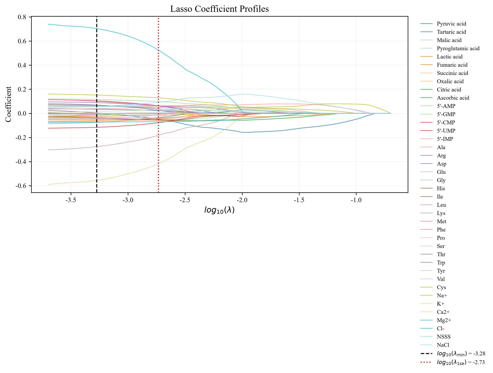
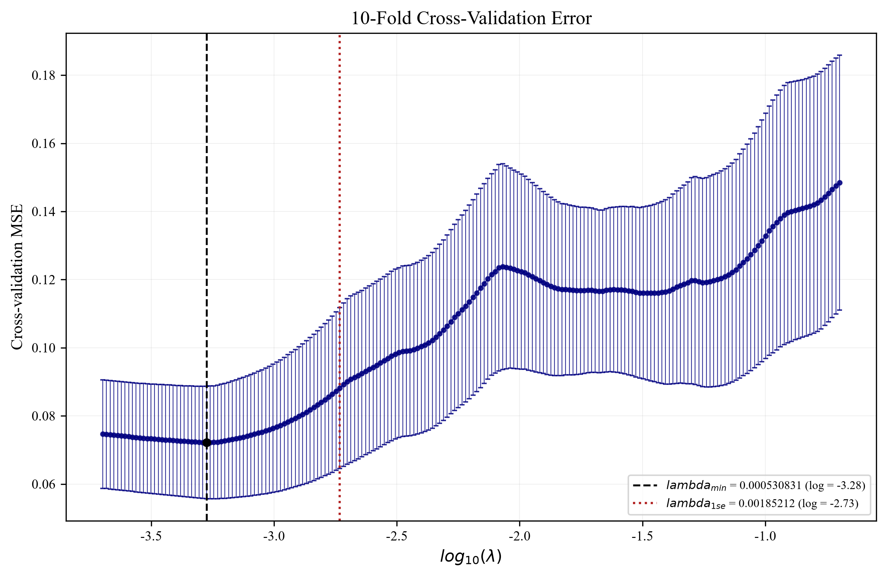
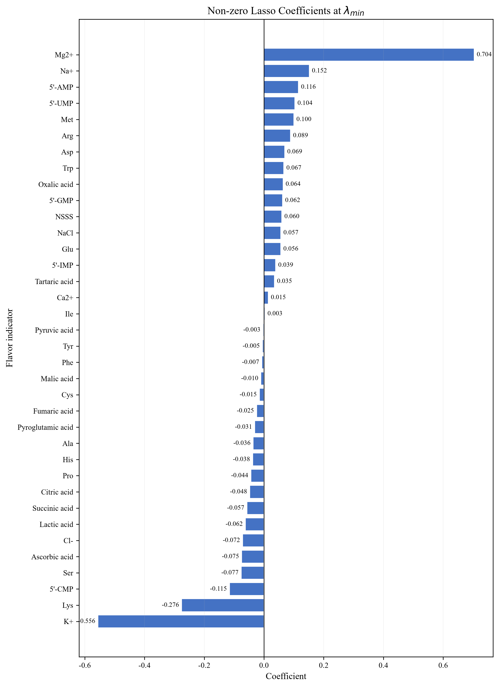

# 题目一：酱油风味物质 Lasso 降维

本文件是根据 [Machine-Learning-Practice/题目一](https://github.com/YileWang-Lab/Machine-Learning-Practice/tree/main/%E9%A2%98%E7%9B%AE%E4%B8%80) 的要求完成的可复现结果。由于原始数据未提供给我，我从该公开仓库下载了题目配套的两个 CSV，并将副本一并放在本输出目录的 `data/` 下。

## 1. 任务与数据

- 观测数：288（48 个样品 × 6 次重复）
- 自变量：40 个风味/理化指标
- 因变量：`咸味评分`
- 建模文件：`data/soy_sauce_flavor_standardized.csv`
- 交叉验证：10 折，`random_state=42`
- 模型：`sklearn.linear_model.LassoCV`
- 惩罚系数网格：200 个 alpha，最大迭代次数 20,000

标准化文件的第一列 `ID` 只作标识，第二列 `咸味评分` 是目标变量，后 40 列进入 Lasso。代码优先使用已经标准化的指标，避免不同计量单位导致 L1 惩罚不公平。

## 2. 核心结果

| 指标 | 结果 |
|---|---:|
| `lambda_min`（最小 CV MSE） | `0.0005308308` |
| `log10(lambda_min)` | `-3.27504385` |
| `lambda_1se`（一倍标准误规则） | `0.0018521226` |
| `log10(lambda_1se)` | `-2.73233028` |
| 最小 CV MSE | `0.07221137` |
| 最小 CV MSE 的标准误 | `0.01648099` |
| `lambda_min` 下非零系数数目 | **36 / 40** |

### 被压缩为 0 的指标

`Gly`（甘氨酸）、`Leu`（亮氨酸）、`Thr`（苏氨酸）、`Val`（缬氨酸）。

### 为什么选择 `lambda_min`

交叉验证误差曲线在 `lambda_min` 附近达到最低点，说明该惩罚水平的预测误差最小。`lambda_1se` 更大，会得到更简约的模型，但它牺牲了一部分拟合性能；在本题中，`lambda_min` 仅保留 36 个指标，仍然已经去除了 4 个变量，因此我把 `lambda_min` 作为后续非线性模型的主降维结果。若研究重点改为变量解释或模型简洁性，则可以报告 `lambda_1se` 作为稳健的简约备选方案。

## 3. 图表

### 图 1：Lasso 系数路径

横轴是 `log10(lambda)`。随着惩罚系数增大，各变量系数逐步向 0 收缩；黑色虚线为 `lambda_min`，红色点线为 `lambda_1se`。



### 图 2：10 折交叉验证 MSE

点为 10 折 MSE 均值，误差棒为 `std / sqrt(10)`。黑色虚线定位误差最小点，红色点线定位一倍标准误规则对应的更强惩罚。



### 图 3：`lambda_min` 下的非零系数

只绘制 36 个未被压缩为 0 的指标，并在柱端标出系数数值。



## 4. 代码分析

主程序为 [`lasso_analysis.py`](lasso_analysis.py)，执行流程如下：

1. 用 `pandas.read_csv` 读取 UTF-8 中文列名，拆分 `X` 和 `y`。
2. 用 `LassoCV(cv=10, random_state=42, max_iter=20000)` 在 200 个 alpha 上拟合模型。`LassoCV` 的 `alpha_` 即 `lambda_min`。
3. 从 `mse_path_` 计算每个 alpha 的 MSE 均值和标准误；先找到最小均值，再取满足“均值不超过最小值 + 最小点标准误”的最大 alpha 作为 `lambda_1se`。
4. 调用 `lasso_path` 计算 40 个指标在完整 alpha 网格上的系数路径，生成系数路径图。
5. 使用 `abs(coef) > 1e-10` 判断非零系数，生成筛选后的水平条形图，并导出系数表。
6. 使用 Matplotlib 的 `Agg` 无界面后端保存 300 dpi PNG，因此脚本可以在没有桌面环境的机器上运行。
7. 同时保存 `lasso_summary.json`、`selected_coefficients.csv` 和 `cv_path.csv`，便于复核图表和数值。

运行命令（Python 3.10+）：

```powershell
pip install -r requirements.txt
python lasso_analysis.py
```

脚本默认从与脚本同级的 `data/` 目录读取数据，并把结果写入同级的 `figures/` 和结果 CSV/JSON 文件。本目录已经包含运行后的图表和结果文件。

## 5. 文件清单

- [`lasso_analysis.py`](lasso_analysis.py)：一键运行的完整分析代码
- [`requirements.txt`](requirements.txt)：依赖版本要求
- 题目原始 CSV 未上传到公开仓库：原题 README 明确说明该数据未经许可不得外传或公开发布；本地 W 盘输出目录仍保留数据副本供你个人复现。
- [`figures/fig1_lasso_paths.png`](figures/fig1_lasso_paths.png)
- [`figures/fig2_cv_mse.png`](figures/fig2_cv_mse.png)
- [`figures/fig3_coefficients.png`](figures/fig3_coefficients.png)
- [`lasso_summary.json`](lasso_summary.json)、[`selected_coefficients.csv`](selected_coefficients.csv)、[`cv_path.csv`](cv_path.csv)：机器可读结果

> 数据说明：题目 README 标注该数据来自课题组研究，未经许可请勿再公开发布。本文件仅用于本次作业结果和代码复现。
